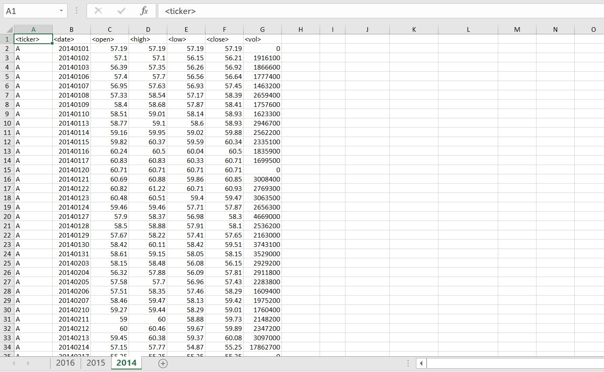
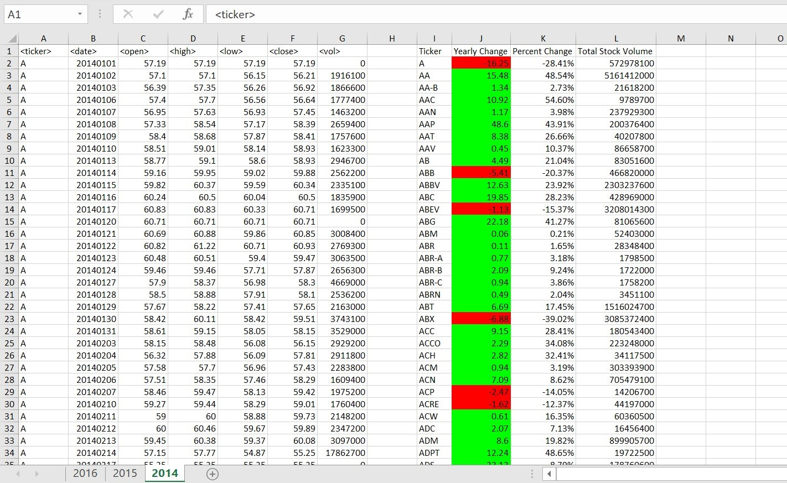
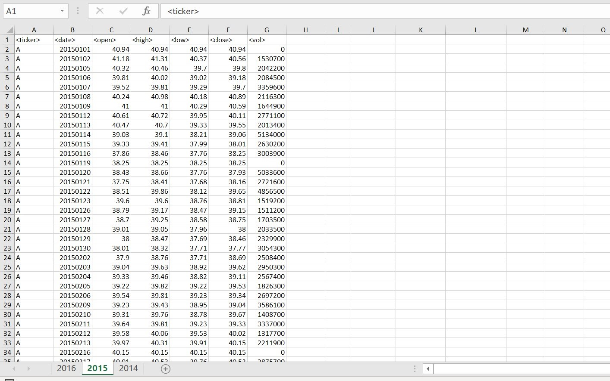
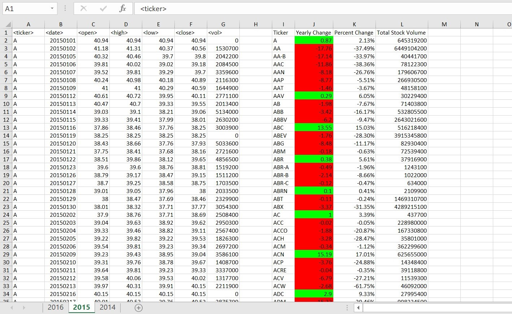
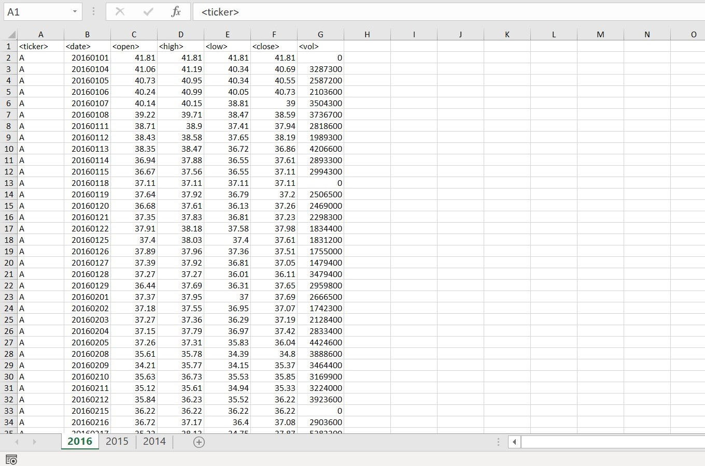
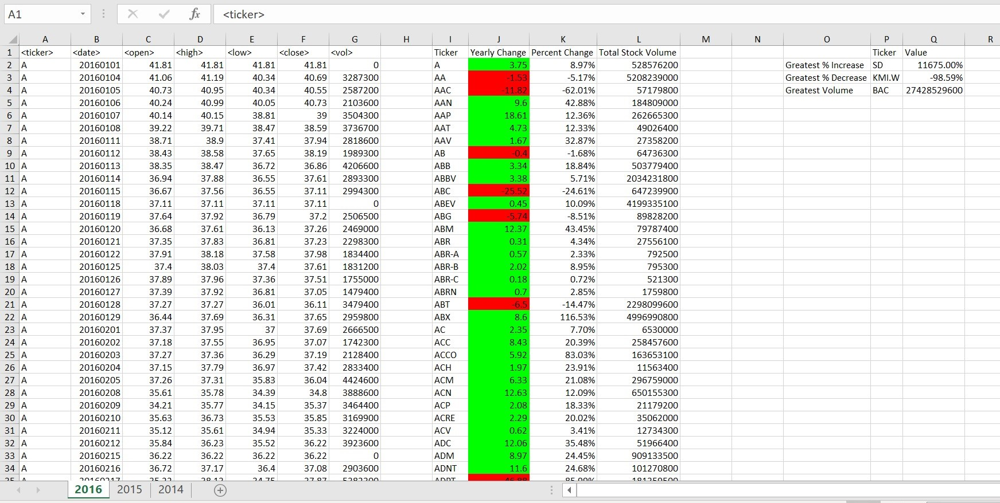

# VBA and Stocks

## Background

In this challenge, I was given an excel document that contains a few years' worth of stock data. There were multiple different stocks that had information regarding the opening, closing, highest, and lowest prices for each stock throughout the year, and data regarding the total volume of the stock for each day.

The initial task was to create a summary of each stock, containing the ticker, the yearly change in price, the percentage of change in price, and the total volume. All formatting, conditional or otherwise, should be included in the script. The script should be able to do this task throughout all the sheets. 

The second task was to create a second summary of the largest percent increase, the largest percent decrease, and the largest volume out of all of the stocks on all sheets. The corresponding tickers should be included in that summary as well. This summary can be seen in the 2016 After photo.

Included in this repository is a simplified version of the Excel file. You can view it [here](Resources/Multi_Year_Stock_Sample.xlsm). Feel free to download it and run the [script](Resources/Stocks.vbs) to see how it works! 

Below are some examples of the data before the script has been run, and after. 
___

## 2014
### Before:

### After:

___

## 2015
### Before:

### After:

___

## 2016
### Before:

### After:
