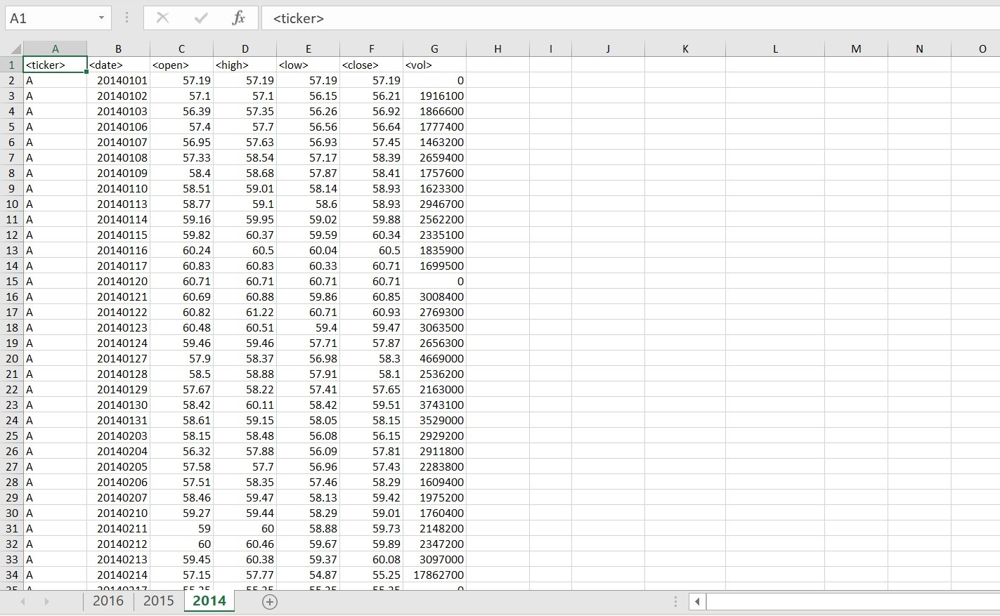
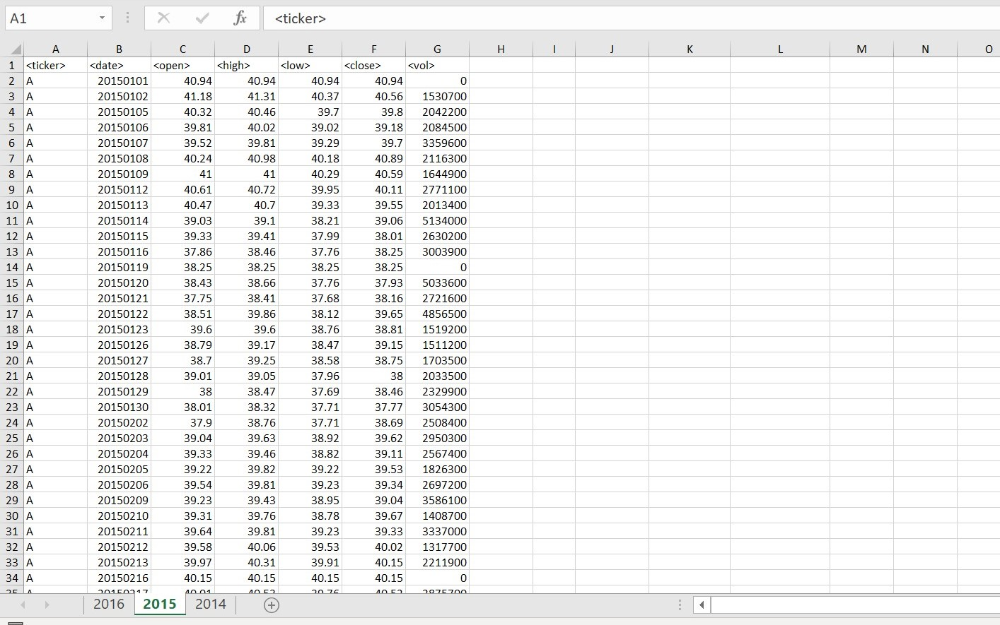
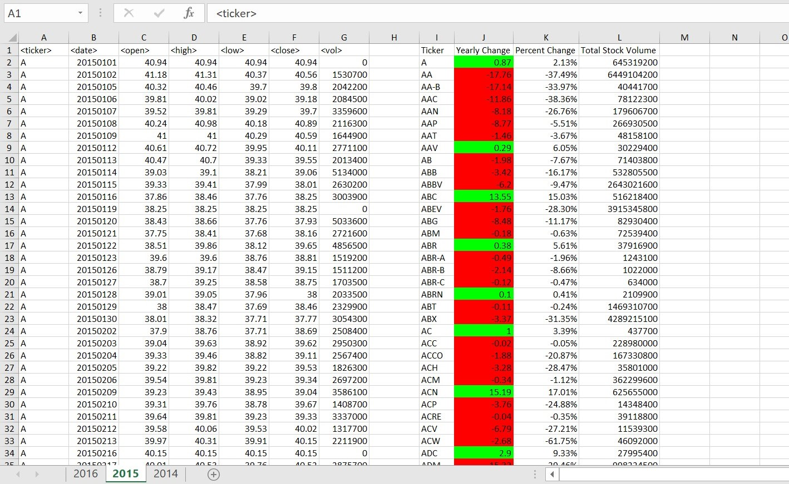
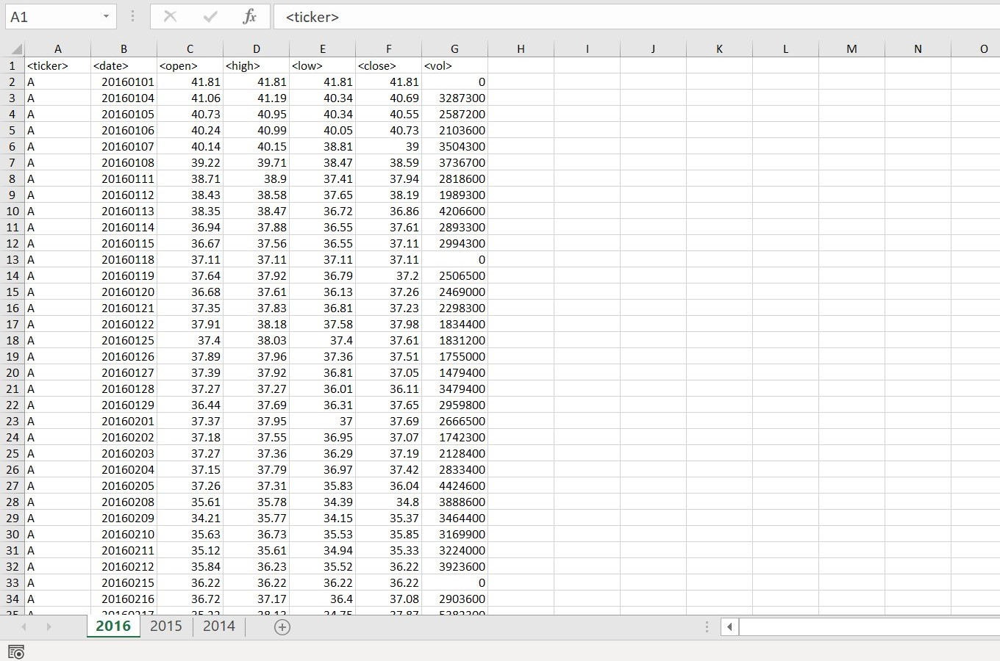
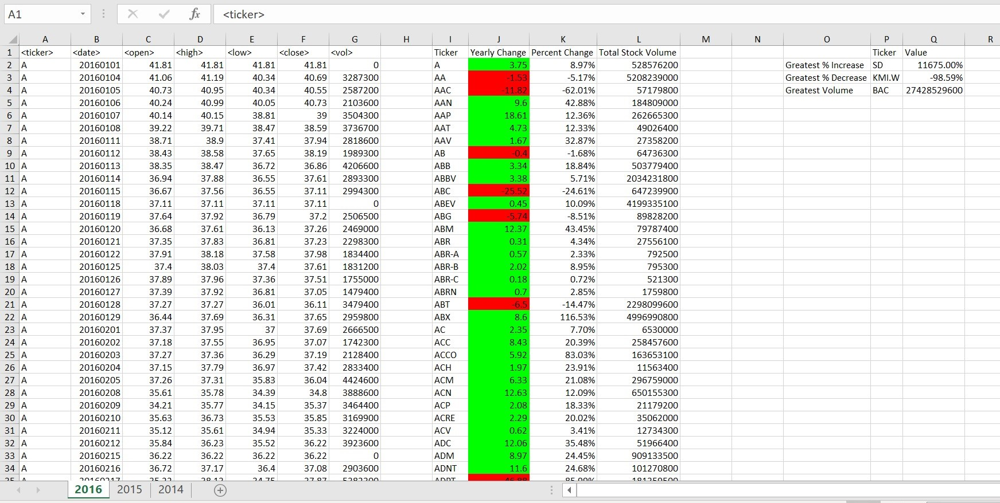

# VBA-Challenge
 In this challenge, I was given an excel spreadsheet with stock data from 2014-2016. I was tasked with creating a summary of the Yearly Change, Percent Change, and Total Volume for each Ticker. 

 I was also asked to format the Percent Change with VBA based on whether it was a positive change or a negative change. 

 Below you can see photos of the spreadsheet before and after running the VBA macro. 
_________________________

## 2014
### Before:

### After:

_________________________
## 2015
### Before:

_________________________
## 2016
### Before:

